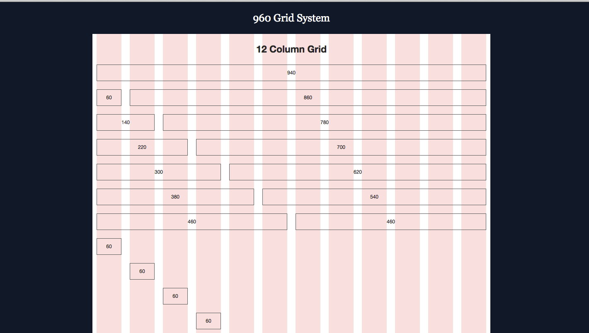

# 960栅格系统
  
> 960栅格系统算是最有名的固定宽度的栅格系统，在1024是普遍分辨率的情况下，960栅格系统非常的好用。  

1. 12 栏布局, 每栏 60px
2. 每栏两边保留 10px 的外边距, 相当于 20px 的槽
3. 内容区域总宽度是 940px

在`1024为主要分辨率的时代`，  
`960`可以`非常方便的解决网页的布局`问题，  
但是随着屏幕分辨率越来越大，各种移动设备的普及，我们就需要新一代响应式的栅格系统了。

* [demo](./code/demo.html)
* [demo for 24 col](./code/demo_24_col.html)
* ... see folder `./code/`

---
**demo 来源：**   
[GitHub: nathansmith/960-Grid-System](https://github.com/nathansmith/960-Grid-System)