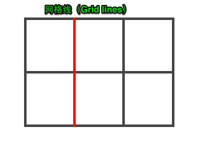
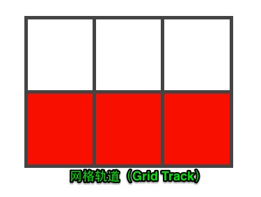
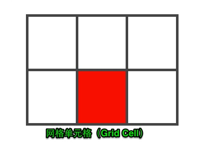
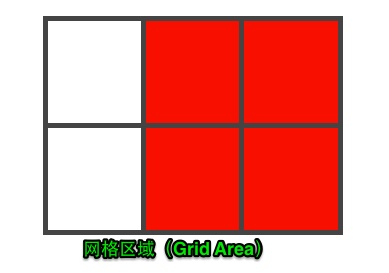
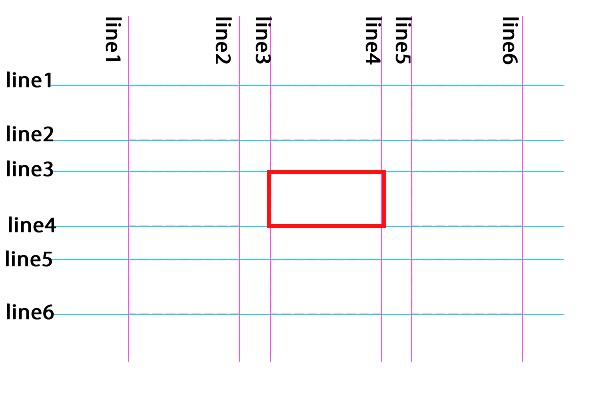

# Grid Layout 删格化布局
通过使用display属性给元素显式设置了属性值grid或inline-grid

## Grid vs Flexbox
1. flexbox是一维布局，他只能在一条直线上放置你的内容区块；
2. grid是一个二维布局。

## 网格术语
1. 网格线(Grid Lines)  
  
2. 网格轨道(Grid Track)  
  
3. 网格单元格(Grid Cell)  
  
4. 网格区域(Grid Area)  
  
5. 网格容器(Grid Containers)  
> 通过使用display属性给元素显式设置了属性值grid或inline-grid  
6. 网格单元格顺序(order)  
> 顺序
---
* CSS来定义网格。
> `display:[ grid | inline-grid ];`   
> \+  
> `grid-template-columns:[ auto | ... ]`  
> `grid-template-rows:[ auto | ... ]`  
* 使用 1:  
```html
<!-- 根据 cols * rows 顺序排列 -->
<div class="wrapper">
    <div class="box a">A</div> 
    <div class="box b">B</div> 
    <div class="box c">C</div> 
    ...
</div>
```
* 使用 2:  

```css
/*按网格线切*/
.sliceByLine{ 
    grid-column-start: 1; 
    grid-column-end: 2; 
    grid-row-start: 1; 
    grid-row-end: 2; 
}
/*简写*/
.sliceByLine{ 
    grid-column: 1 / 2; 
    grid-row: 1 / 2;
}
/*更简*/
.sliceByLine{ 
    grid-area: 1 / 1 / 2 / 2;
}
```

---
###### 引用原文:  
[概念](https://www.w3cplus.com/css3/what-is-css-grid-layout.html)
[用法](https://www.w3cplus.com/css3/line-base-placement-layout.html)