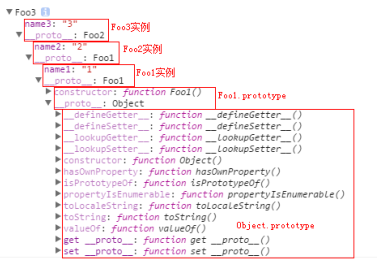

# JS中有对象吗？
有.
# JS能面向对象么?
能.

> 我胡说几句:  
> `{key:value,...,...,...}` 这就是对象  
> `{k:v,k:v} + {k:v}` 这就是继承

# JS 的对象来源，起源。
原型链。

# 原型链
原型链可以说是一个比喻的说法。js 的对象是个个相互可追溯的对象相关起来的。所以原型链更像一个追溯过程。我们先从基本对象看起
## 普通对象、函数对象（不必深究，但要明白）
```javascript
var o1 = {};
var o2 = new Object();
var o3 = new f1();

function f1(){}; 
var f2 = function(){};
var f3 = new Function('str','console.log(str)');

console.log(typeof Object); //function 
console.log(typeof Function); //function  

console.log(typeof f1); //function 
console.log(typeof f2); //function 
console.log(typeof f3); //function   

console.log(typeof o1); //object 
console.log(typeof o2); //object 
console.log(typeof o3); //object
```
> 我胡说几句:  
> 就当js中任何东西都是对象`{}`，但这些对象里有些是能执行的，  
> 也可以这么理解：  
> `book = {内容}, bomb = {我会爆炸}` 大约就像一些东西是`名词`，另一部分是`动词`，但都是`词`  
> 假设可执行的对象：`bomb = {我会爆炸}`  
> 你想得到他执行后的结果: `bomb()`, 加上括号他就会运行,你会得到结果`爆炸了`.  
> 或者你不想执行它，只是挪动他，交换它，替换它: `bomb`，这个行为炸弹不会爆炸，不会产生别的后果。    

Q: `log` 出来的 `typeof` 结果从何而来？
A: `prototype`
## prototype 与 _proto_ 的关系
* `_proto_` 是站在对象角度来说的
* `prototype` 是站在构造函数角度来说的
```javascript
var obj = new Object();
// 对象是有原型对象的 原型对象也有原型对象 
//   obj._proto_._proto_._proto_
// 原型对象也有原型对象，对象的原型对象一直往上找，会找到一个null
// 原型链示例
   var arr = [];
   arr -> Array.prototype ->Object.prototype -> null
   var o = new Object();
   o -> Object.prototype -> null;
```

# EX: 例
```javascript
function Foo1(){
   this.name1 = '1';
}
function Foo2(){
   this.name2 = '2';
}
Foo2.prototype = new Foo1();
function Foo3(){
   this.name = '3';
}
Foo3.prototype = new Foo2();
var foo3 = new Foo3();
console.dir(foo3);
```



Q: 继承？  
A: `Foo2.prototype = new Foo1();` 就是继承  

`class foo2 extend foo1 `
`{foo2} + {foo1}`

# 面相对象 & 继承

> 我胡说几句:  
ES5，ES6，更新了多种面相对象方式；  
ES5 提供了Object.create() 方法来实现继承  
ES6 提供了更普遍、常见的 extend 继承  

搞懂这个就好  
```javascript
function Animal(name){
  this.name = name;
}
function Tiger(color){
  this.color = color;
}
var tiger = new Tiger('yellow');
console.log(tiger.color);
console.log(tiger.name);  //undefined
Tiger.prototype = new Animal('老虎');   //一种方式

// Object.prototype.name = '大老虎';   //第二种方式
// var tiger = new Tiger('yellow');
// console.log(tiger.color);
// console.log(tiger.name);
```
> [其它更多种方式，深入理解，选读](./继承.md)

[追加一篇详解](https://www.jianshu.com/p/dee9f8b14771)
