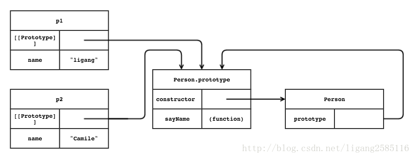

1. `__proto__`是每个对象都有的一个属性，
2. `prototype`是函数才会有的属性
3. 使用`Object.getPrototypeOf()`代替`__proto__`

# prototype
几乎所有的函数（除了一些内建函数）都有一个名为prototype（原型）的属性，  
这个属性是一个指针，指向一个对象，而这个对象的用途是包含可以有特定类型的所有实例共享的属性和方法。  
prototype是通过调用构造函数而创建的那个对象实例的原型对象。  
hasOwnProperty()判断指定属性是否为自有属性；in操作符对原型属性和自有属性都返回true。   
```javascript
//示例：自有属性&原型属性
var obj = {a: 1};
obj.hasOwnProperty("a"); // true
obj.hasOwnProperty("toString"); // false
"a" in obj; // true
"toString" in obj; // true


//示例：鉴别原型属性
function hasPrototypeProperty(obj, name){
    return name in obj && !obj.hasOwnProperty(name);
}
```

# `__proto__`
对象具有属性__proto__，可称为隐式原型，  
一个对象的隐式原型指向构造该对象的构造函数的原型，  
这也保证了**实例能够访问在构造函数原型中定义的属性和方法**。
```javascript
 function Foo(){}
 var Boo = {name: "Boo"};
 Foo.prototype = Boo;
 var f = new Foo();
 
 console.log(f.__proto__ === Foo.prototype); // true
 console.log(f.__proto__ === Boo);   // true
 Object.getPrototypeOf(f) === f.__proto__;   // true
```
# `Object.getPrototypeOf()`
一个对象实例通过内部属性`[[Prototype]]`跟踪其原型对象。  
使用原型对象的好处是可以让所有对象实例共享它所包含的属性和方法。  
可以调用对象的`Object.getPrototypeOf()`方法读取`[[Prototype]]`属性的值，  
也可以使用`isPrototypeOf()`方法检查某个对象是否是另一个对象的原型对象。  
大部分`JavaScript引擎`在所有对象上都支持一个名为`__proto__`的属性，该属性可以直接读写`[[Prototype]]`属性。 
```javascript
//示例：原型对象
function Person(name) {
    this.name = name;
}
Person.prototype = {
    constructor: Person,
    sayName: function(){
        console.log("my name is " + this.name);
    }
}
var p1 = new Person("ligang");
var p2 = new Person("Camile");
p1.sayName();   // my name is ligang
p2.sayName();   // my name is Camile
```

