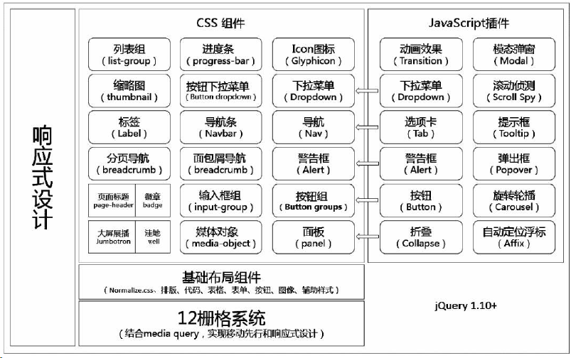

# 读懂bootstrap

bootstrap 架构图

# Step 1. LESS
1. You can copy `less` directory form bootstrap resource to new dir;
2. 对于编译 LESS 文件，Bootstrap 官方只支持 Recess，这是 Twitter 的基于 less.js 的 CSS 提示。
3. [webste for learn less,chinese](http://www.bootcss.com/p/lesscss/)
4. 其中包含至少20多个less文件，那为什么要分成这么多个呢？
    1. 方便开发，后期也便于维护
    2. 便于用户修改样式。
    3. 确保样式的统一
5. 合并编译less文件 --> bootstrap.less [this file](./bootstrap-3.3.7/less/bootstrap.less)
6. I noticed `bootstrap.less` file at [copy file](./Learn-Less/less/bootstrap.less)
7.
8.