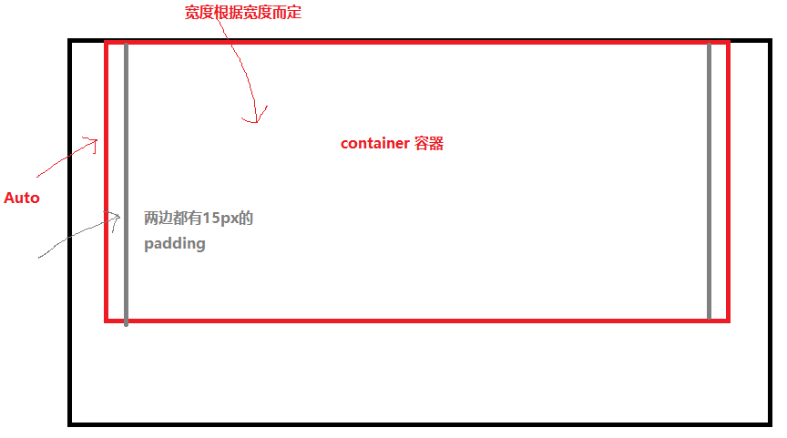
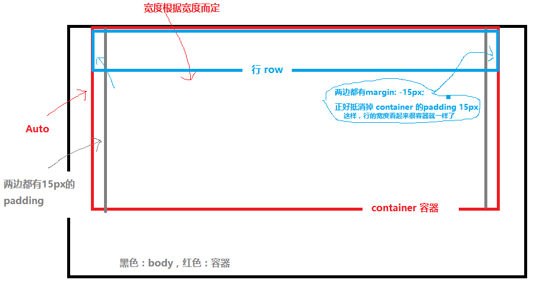
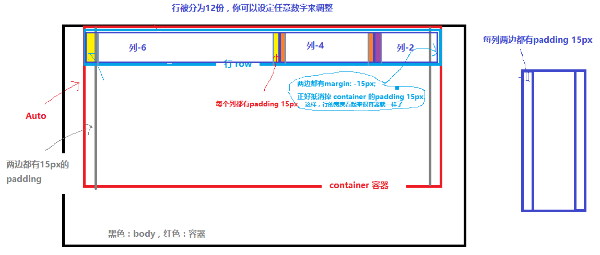

# Bootstrap 栅格布局 
> 定制Bootstrap，只使用`Grid System` [中文-定制](http://v3.bootcss.com/customize/?id=7486b5c46b396c33388be74d27a4f006)
# 原理
1. `box-sizing:border-box;`
被定义的元素的内边距和边框不再会增加它的宽度，不加入的话排版会有问题。
```css
* {
    -webkit-box-sizing: border-box;
    -moz-box-sizing: border-box;
    box-sizing: border-box;
}
```
2. 容器 container  
  
> Padding 15px 容器 container 里面写其他东西，不至于挨边  
> `margin-right: auto;` 制造居中  
```css
.container {
  padding-right: 15px;
  padding-left: 15px;
  margin-right: auto;
  margin-left: auto;
}
@media (min-width: 768px) {/*当宽度大于768px时触发*/
  .container {
    width: 750px;
  }
}
@media (min-width: 992px) {/*当宽度大于992px时触发*/
  .container {
    width: 970px;
  }
}
@media (min-width: 1200px) {/*当宽度大于1200px时触发*/
  .container {
    width: 1170px;
  }
}
.container-fluid { /*这个是宽度默认*/
  padding-right: 15px;
  padding-left: 15px;
  margin-right: auto;
  margin-left: auto;
}
```
3. 行 row
  
> `-15px`抵消container的`15px margin`
```css
.row {
  margin-right: -15px;
  margin-left: -15px;
}
```
4. 列 Column
  
> 根据媒体查询`@media`选择不同的列分割；  
> 每个row，最多12格  

||||
|:---|:---|:---|
|.col-xs-*| 针对超小屏幕 手机|（<768px）
.col-sm-*| 小屏幕 平板| (≥768px)
.col-md-*| 中等屏幕 桌面显示器| (≥992px)(栅格参数)
.col-lg-*| 针对特大的|（≥1200px）

---
### 中等屏幕 column 实现
```css
@media (min-width: 992px) {
  .col-md-1, .col-md-2, .col-md-3, .col-md-4, .col-md-5, .col-md-6, .col-md-7, .col-md-8, .col-md-9, .col-md-10, .col-md-11, .col-md-12 {
    float: left;
  }
  .col-md-12 {
    width: 100%;
  }
  .col-md-11 {
    width: 91.66666667%;
  }
  .col-md-10 {
    width: 83.33333333%;
  }
  .col-md-9 {
    width: 75%;
  }
  .col-md-8 {
    width: 66.66666667%;
  }
  .col-md-7 {
    width: 58.33333333%;
  }
  .col-md-6 {
    width: 50%;
  }
  .col-md-5 {
    width: 41.66666667%;
  }
  .col-md-4 {
    width: 33.33333333%;
  }
  .col-md-3 {
    width: 25%;
  }
  .col-md-2 {
    width: 16.66666667%;
  }
  .col-md-1 {
    width: 8.33333333%;
  }
  .col-md-pull-12 {
    right: 100%;
  }
  .col-md-pull-11 {
    right: 91.66666667%;
  }
  .col-md-pull-10 {
    right: 83.33333333%;
  }
  .col-md-pull-9 {
    right: 75%;
  }
  .col-md-pull-8 {
    right: 66.66666667%;
  }
  .col-md-pull-7 {
    right: 58.33333333%;
  }
  .col-md-pull-6 {
    right: 50%;
  }
  .col-md-pull-5 {
    right: 41.66666667%;
  }
  .col-md-pull-4 {
    right: 33.33333333%;
  }
  .col-md-pull-3 {
    right: 25%;
  }
  .col-md-pull-2 {
    right: 16.66666667%;
  }
  .col-md-pull-1 {
    right: 8.33333333%;
  }
  .col-md-pull-0 {
    right: auto;
  }
  .col-md-push-12 {
    left: 100%;
  }
  .col-md-push-11 {
    left: 91.66666667%;
  }
  .col-md-push-10 {
    left: 83.33333333%;
  }
  .col-md-push-9 {
    left: 75%;
  }
  .col-md-push-8 {
    left: 66.66666667%;
  }
  .col-md-push-7 {
    left: 58.33333333%;
  }
  .col-md-push-6 {
    left: 50%;
  }
  .col-md-push-5 {
    left: 41.66666667%;
  }
  .col-md-push-4 {
    left: 33.33333333%;
  }
  .col-md-push-3 {
    left: 25%;
  }
  .col-md-push-2 {
    left: 16.66666667%;
  }
  .col-md-push-1 {
    left: 8.33333333%;
  }
  .col-md-push-0 {
    left: auto;
  }
  .col-md-offset-12 {
    margin-left: 100%;
  }
  .col-md-offset-11 {
    margin-left: 91.66666667%;
  }
  .col-md-offset-10 {
    margin-left: 83.33333333%;
  }
  .col-md-offset-9 {
    margin-left: 75%;
  }
  .col-md-offset-8 {
    margin-left: 66.66666667%;
  }
  .col-md-offset-7 {
    margin-left: 58.33333333%;
  }
  .col-md-offset-6 {
    margin-left: 50%;
  }
  .col-md-offset-5 {
    margin-left: 41.66666667%;
  }
  .col-md-offset-4 {
    margin-left: 33.33333333%;
  }
  .col-md-offset-3 {
    margin-left: 25%;
  }
  .col-md-offset-2 {
    margin-left: 16.66666667%;
  }
  .col-md-offset-1 {
    margin-left: 8.33333333%;
  }
  .col-md-offset-0 {
    margin-left: 0;
  }
}

```