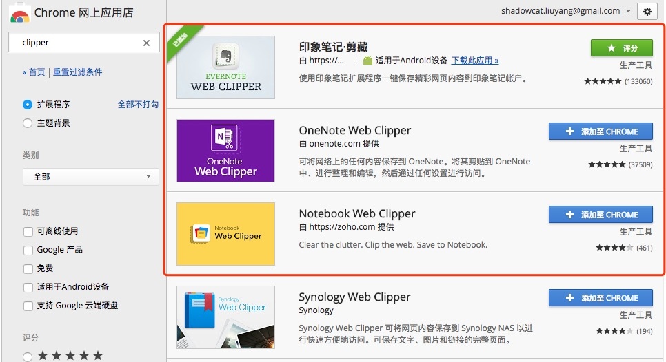
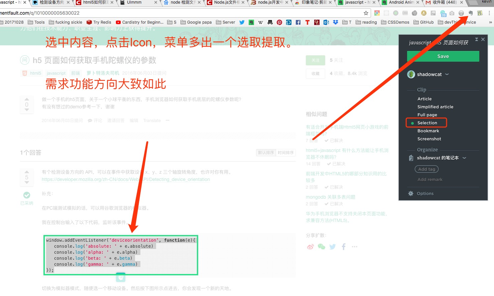
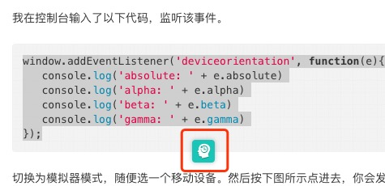

### chrome插件 内容剪裁
#### 参考软件
> [Evernote Clipper](https://chrome.google.com/webstore/detail/evernote-web-clipper/pioclpoplcdbaefihamjohnefbikjilc?utm_source=chrome-ntp-icon)  

#### 基本需求

1. 插件Icon点击，在页面内附加`操作选项菜单`；

2. 鼠标悬停位置，或者，鼠标选中区域，触发`操作提示按键`：
> 参考样式:  
> 
3. 摘录制定区域到`预览窗口`(可以与`操作选项菜单`在一起)
4. `保存`摘录内容 (其实就是下载文件)
5. 使用框架+UI库；
#### 优化
1. 优化摘抄功能
  1.1 css样式提取并携带 （难）
  1.2 提取信息优化。
  1.3 `预览窗口` 可编辑
2. `保存` 功能增加
  1.1 markdown方式保存
  1.2 html方式保存
3. 
#### 程序迭代
1. `页面截屏` 模拟 `screenshot` 功能
2. 记录 `引用来源` 的信息
3. `配置选项` 下载位置配置
4. 高级操作 例如：`撤销` 
5. 
6.   

---

#### 注意查看版本比较，我也许会提交功能增项
