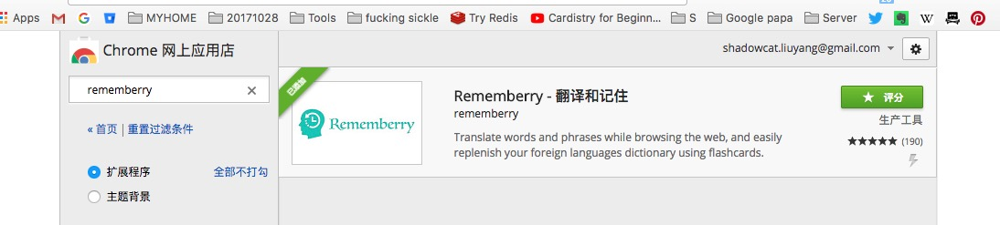

### 单词记忆与复习
这个没多少要说的，就是照抄吧，每个功能都很好
#### 参考软件
> [rememberry](https://chrome.google.com/webstore/detail/rememberry-translate-and/dipiagiiohfljcicegpgffpbnjmgjcnf?utm_source=chrome-ntp-icon)  

#### 基本需求
1. 选词-》提示按钮-》翻译-》可以选择保存
2. 定时提醒复习单词
3. 单词卡复习功能  

可能用到的技术：  
* 有道词典有翻译接口；  
* web storage；保存数据到浏览器缓存
* 
