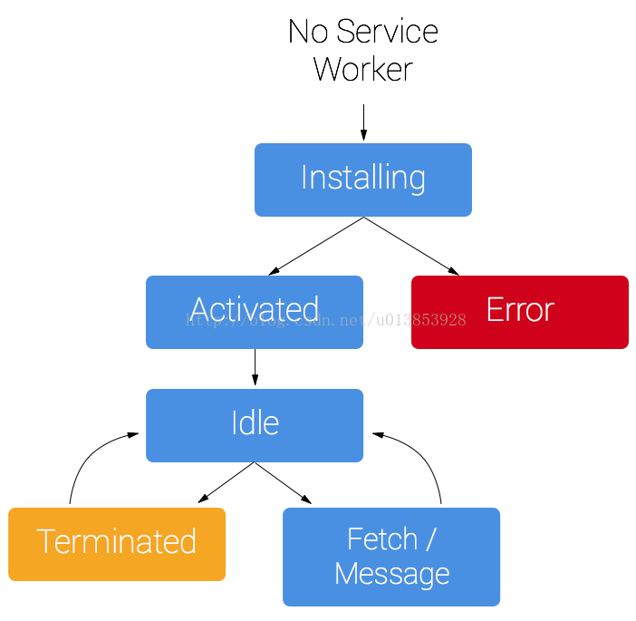

### 一、Service Worker是什么？
一段运行在浏览器后台进程里的脚本，  
独立于当前页面，  
提供了那些不需要与web页面交互的功能在网页背后悄悄执行的能力。  
在将来，基于它可以实现消息推送，静静更新以及地理围栏等服务，但是目前它首先要具备的功能是拦截和处理网络请求的功能，包括可编程的消息缓存管理能力。
### 二、Service Worker的作用 
1. 网络代理，转发请求，伪造响应 
2. 离线缓存
3. 消息推送
4. 后台消息传递
### 三、Service Worker生命周期



### 安装
要安装Service Worker你需要在你的界面上注册它，这个步骤告诉浏览器你的Service Worker脚本放在哪里
```javascript
if ('serviceWorker' in navigator) {  
  navigator.serviceWorker.register('/sw.js').then(function(registration) {  
    console.log('ServiceWorker registration successful with scope: ',    registration.scope);  
  }).catch(function(err) {  
    console.log('ServiceWorker registration failed: ', err);  
  });  
}  
```
以上代码会先检测ServiceWorker API在浏览器中是否可用，
可用的话一个Service Worker（/sw.js）将被注册，
如果这个Service Worker已经注册过了，则浏览器则会忽略以上代码。

注册成功后，则可以打开 `chrome://serviceworker-internals/`查看浏览器的Service Worker信息。
> 特别注意的是Service Worker文件的路径问题，你一定注意到了，上面代码中sw.js存放在网站的根路径下，如果存放在网站的根路径下，则表示该Service Worker将会收到该网站的所有fetch事件，如果我们将Service Worker文件注册为/example/sw.js，则代表该Service Worker将只会收到/example/路径下的fetch事件。
    以上步骤只是注册了一个Service Worker脚本，注册完成后将会安装，安装过程在Service Worker脚本中进行
    
#### sw.js：
```javascript
var CACHE_NAME = "my_cache";  
   var urlsToCache = [  
    '/index.html',  
    '/css/style.css',  
    '/js/script.js'  
   ];  
//这里的self代表ServiceWorkerGlobalScope  
self.addEventListener('install', function(event) {  
//这里的waitUtil会在安装成功之前执行一些预装的操作，但是只建议做一些轻量级和非常重要资源的缓存，减少安装失败的概率。安装成功  
//后ServiceWorker状态会从installing变为installed   
event.waitUntil(  
        caches.open(CACHE_NAME).then(function(cache) {  
             console.log('Opendhe : ',cache);  
            return cache.addAll(urlsToCache);  
      })  
    );  
});  
```
CACHE_NAME代表这个缓存的名字，urlToCache代表初次缓存的文件  
```text
通过caches.open 打开我们指定的cache文件名，  
然后我们调用cache.addAll并传入我们的文件数组。  
这是通过一连串的promise（caches.open和caches.addAll）  
完成的event.waitUntil拿到一个promise的状态来获取安装是否成功，  
如果所有的文件都被缓存成功了，  
那么Service Worker就安装成功了。  
如果任何一个文件下载安装失败，那么整个Service Worker的安装就失败。  
这意味着你需要非常谨慎地决定那些文件需要在安装步骤中被缓存，指定太多文件的话就会增加整个Service Worker应用安装失败的概率。
```


#### 利用Service Worker监听网络请求（伪造相应或增加缓存文件）
#### 销毁
是否销毁由*浏览器决定*，如果一个Service Worker*长期不使用*或者机器*内存有限*，则浏览器可能会销毁这个Service Worker
### 利用Service Worker监听网络请求
当Service Worker被安装成功并且用户浏览了另一个页面，Service Worker将开始接受`fetch`事件。下面是一个例子：
```javascript
self.addEventListener('fetch', function(event) {  
  event.respondWith(  
    caches.match(event.request)  
      .then(function(response) {  
        // Cache hit - return response  
        if (response) {  
          return response;  
        }  
        return fetch(event.request);  
      }  
    )  
  );  
}); 
```
* 上面的代码里我们监听了fetch事件，
* 在event.respondWith里我们传入了一个由caches.match产生的promise.caches.match查找request中被Service Worker缓存命中的response。
* 如果我们有一个命中的response，我们返回被缓存的值，否则我们返回一个实时从网络请求的结果。
    如果我们想要增量德缓存新的请求，我们可以通过处理fetch请求的response并且添加它们到缓存中来实现，例如：
```javascript
self.addEventListener('fetch', function(event) {  
  event.respondWith(  
    caches.match(event.request)  
      .then(function(response) {  
        if (response) {  
          return response;  
        }  
        var fetchRequest = event.request.clone();  
        return fetch(fetchRequest).then(  
          function(response) {  
            if(!response || response.status !== 200 ||!response.headers.get('Content-type').match(/image/)) {  
              return response;  
            }  
            var responseToCache = response.clone();  
            caches.open(CACHE_NAME)  
              .then(function(cache) {  
                cache.put(event.request, responseToCache);  
              });  
  
            return response;  
          }  
        );  
      })  
    ); 
}); 
```
1. 首先检查缓存中是否已经缓存了这个请求，
    1. 如果有，则直接返回相应，这样就减少了一次网络请求，
    2. 否则有Service Worker发起请求，这时的Service Worker起到一个中间代理的作用。
2. Service Worker请求的过程通过fetch api完成，得到response对象之后进行过滤，
    1. 查看是否是图片文件，如果不是，则直接返回请求，不会缓存。    
    2. 如果是图片文件，要先复制一份response，原因是request或者response对象属于stream，只能使用一次，之后一份存入缓存，另一份发送个页面。
3. 这就是Service Worker的强大之处：拦截请求，伪造请求。在这个过程中fetch API起到了很大的作用。

#### 与Service Worker相关的事件
`fetch事件`:  
在页面发起http/https请求时，Service Worker可以通过fetch事件拦截请求，并且给出自己的相应。  
w3c提供了一个新的fetch API可用于取代XMLHttpRequest，  
与XMLHttpRequest最大的不同就是：fetch方法返回的是promise对象，可通过then方法进行连续调用，减少嵌套。  
`message事件`:  
页面和ServiceWorker质检可以通过postMessage方法发送消息，发送的消息可以通过message事件接收到。  
这是一个双向的过程，页面可以发消息给Service Worker，Service Worker也可以发送消息给页面，  
由于这个特性，可以将Service Worker作为中间纽带，使得一个域名或者子域名下的多个页面自由通信页可以实现服务器消息推送的功能。  
### 浏览器的实现情况


|-|Chrome	|Firefox	|IE	|Opera	|Safari|
|---|---|---|---|---|---|
|基本功能	|40.0|	44.0|	不支持|	24|	不支持|
|install/activate events|	40.0|	44.0|	不支持|	24|	不支持|
|fetch event/request/respondWith|	40.0|	44.0|	不支持|	不支持|	不支持|
|caches/cache|	42.0|	39.0|	不支持|	不支持|	不支持|